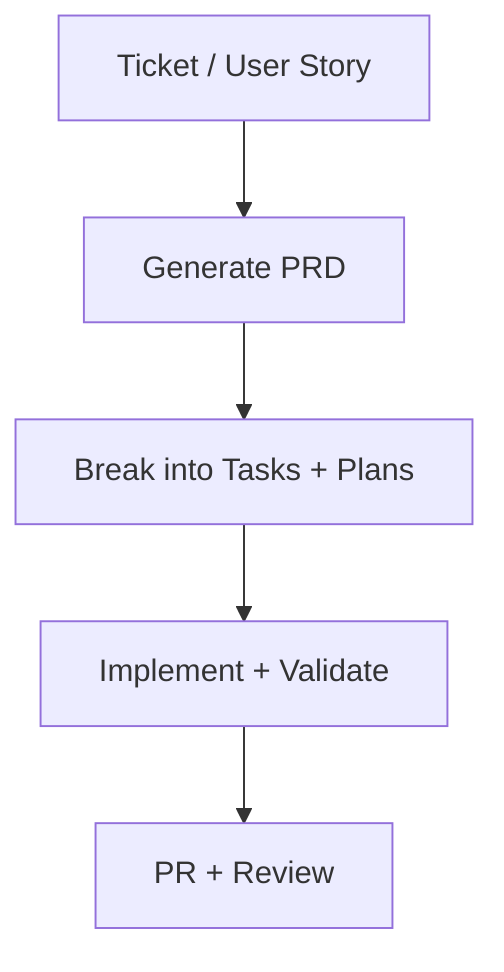

# AI Driven Development

AI can write code fast. That's not the hard part. The hard part is making sure it writes the *right* code: code that solves the actual problem, fits the existing architecture, handles edge cases, and doesn't introduce regressions. Speed without direction just produces more code to debug.

This playbook is a structured development workflow where AI handles the research, drafting, and execution while the human stays in the decision seat at every stage. You interrogate requirements before a line is written. You approve the plan before implementation starts. You validate the output in a fresh context so the AI can't gloss over its own mistakes. The AI writes the code, but you do the thinking.

The workflow has four phases, each covered in its own page:

1. **[Generating a PRD](generating-a-prd.md)** — Interrogate the requirements with AI help and produce a product requirements document with clear acceptance criteria and manual verification steps.
2. **[Task Breakdown and Planning](task-breakdown-and-planning.md)** — Break the PRD into parallelizable tasks, then use AI to create detailed implementation plans with automated and manual verification.
3. **[Implementation and Validation](implementation-and-validation.md)** — Execute the plans, validate in a fresh AI session, and handle the feedback loop when things don't match.
4. **[PR Strategy](pr-strategy.md)** — Structure your pull requests so reviewers can give meaningful feedback and the feature can be rolled back cleanly.

## When to Use

- You're picking up a ticket, user story, or feature request that involves meaningful code changes.
- The work is complex enough that jumping straight to implementation would produce throwaway code.
- You want the AI to do real research into the codebase before proposing changes, not just guess from the file you have open.
- You're working on something where the cost of a wrong approach is high: touching shared infrastructure, changing data models, modifying public APIs.
- You want an auditable trail from requirements through to implementation.

## When Not to Use

- Quick bug fixes where you already know the cause and the fix.
- Trivial changes: copy updates, config tweaks, adding a field to an existing form.
- Exploratory spikes where you're deliberately trying things without committing to an approach. Use [Rubber Duck with Memory](../rubber-duck-with-memory.md) for that.

## The Workflow at a Glance

## Tooling

This workflow uses a set of slash commands that are configured per-repository. Both Claude Code and OpenCode support these commands through their respective configuration directories (`.claude/commands/` for Claude Code, `.opencode/commands/` for OpenCode). Each repo will have its own adjusted versions since they encode repo-specific paths, test commands, and conventions. See [Adapting Development Skills to Your Repo](../../best-practices/adapting-dev-skills.md) for how to customize them. The core commands are:

- `/research_codebase` — Spawns parallel agents to document how the codebase works today, without suggesting changes. Produces a research document in `thoughts/shared/research/`.
- `/create_plan` — Interactive planning that researches the codebase, surfaces questions, and writes a detailed implementation plan with phased changes and separated automated/manual verification.
- `/iterate_plan` — Surgical updates to an existing plan based on feedback, with fresh research when needed.
- `/implement_plan` — Executes a plan phase by phase, pausing for manual verification between phases.
- `/validate_plan` — Checks that an implementation matches its plan. Run this in a fresh session so the validator has no memory of writing the code.
- `/create_adr` — Documents architectural decisions as immutable records with context, options considered, and rationale.
- `/describe_pr` — Generates a PR description from the diff, embeds the implementation plan, and runs verification checks.

The AI also uses specialized agents during research and planning:

- **codebase-locator** — Finds files and components related to a feature
- **codebase-analyzer** — Understands how specific code works
- **codebase-pattern-finder** — Finds similar implementations to model after
- **thoughts-locator / thoughts-analyzer** — Discovers and extracts insights from prior research, plans, and decisions

## Related Playbooks

- [Decision Documentation](../decision-documentation.md) — When the AI or the planning process surfaces a significant architectural choice, document it. The `/create_adr` command handles this within the workflow.
- [Rubber Duck with Memory](../rubber-duck-with-memory.md) — If you're uncertain about the approach before you start planning, talk it through first. The document from a rubber duck session can feed directly into the PRD phase.
- [SOP / Process Documentation](../sop-process-documentation.md) — If the feature introduces a new operational process, document it alongside the code.
